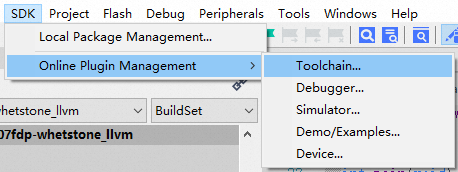
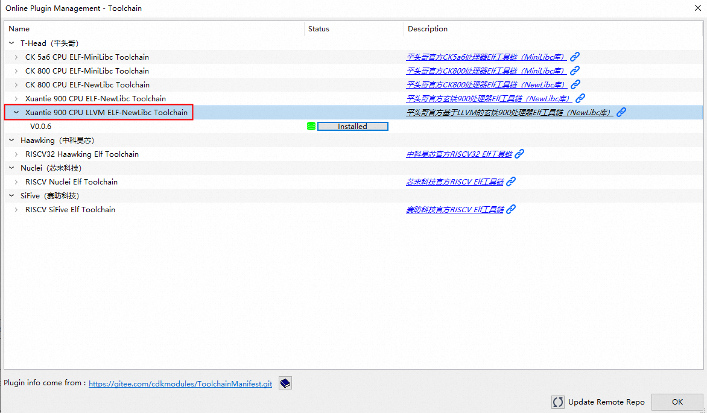
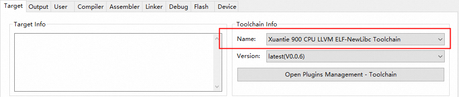

# CDK中使用玄铁LLVM工具链教程
CDK V2.22.0版本支持了玄铁LLVM工具链，并且支持对玄铁GCC工具链的替换功能，
本文将分享如何使用玄铁LLVM工具链对玄铁CPU进行开发

#### 第一步 确认玄铁LLVM工具链插件是否发布

点击CDK菜单栏SDK->Online Plugin Management->Toolchain...

然后弹出的对话框中确认T-Head节点下，是否存在Xuantie 900 CPU LLVM ELF-NewLibc Toolchain的节点

如果不存在此节点，需要点击底部的Update Remote Repo，更新CDK的插件仓库；

更新完成仓库以后，T-Head节点下，Xuantie 900 CPU LLVM ELF-NewLibc Toolchain应该存在了；

***

#### 第二步 玄铁LLVM工具链插件的下载和安装
第一步中的Online Plugin Management窗口中，展开Xuantie 900 CPU LLVM ELF-NewLibc Toolchain节点，

确认V0.0.6版本的状态，如果不是Installed状态，则点击install，进行在线安装；
因为工具链镜像大小比较大（>500MB），所以下载和安装时间可能会稍微长一些；

等待CDK的下载和安装，直到CDK主界面底部状态栏中有绿色闪烁的Plugin Installed字样，表示插件已经安装完成了；

***

#### 第三步 工程选择玄铁LLVM工具链

点击基于玄铁900系列处理器的CDK工程配置界面，选择Target Tab，并在该界面中的Toolchain Info处配置玄铁LLVM工具链；

点击OK，即完成玄铁LLVM工具链的配置，后续的工程构建，都会使用玄铁LLVM工具链；

# GCC工具链切换LLVM工具链常见问题 

如果使用中存在问题，欢迎访问 [玄铁GCC工具链切换玄铁LLVM工具链常见问题汇总](../Q_A/index.md)

# 其它问题、意见和建议
如果您在使用中遇到了其它难以解决的问题或者有更好的改进意见和建议，欢迎提交
[OCC工单](https://xuantie.t-head.cn/people/workorder-submit)，把问题或建议及时反馈给我们；

 
 

***

平头哥半导体有限公司 版权所有

