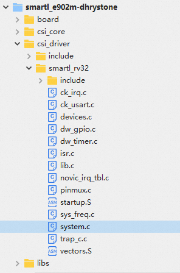
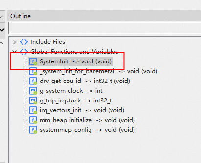
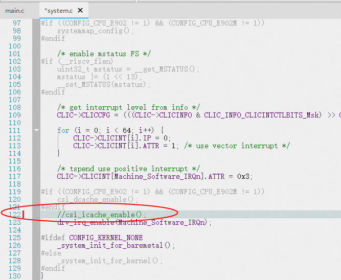
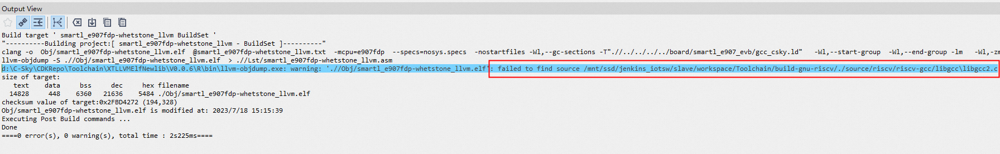
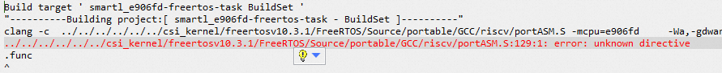
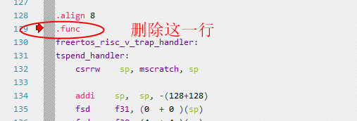

# 玄铁GCC工具链切换玄铁LLVM工具链常见问题汇总 
虽然玄铁LLVM工具链最大程度的兼容玄铁GCC工具链的使用习惯，但优于两者的代码框架差别很大，这就造成了某些具体使用时，
玄铁LLVM工具链和玄铁GCC工具链仍然有一些不太兼容的地方，为了能够让用户更方便地使用代码密度更优、
程序性能更好的玄铁LLVM工具链， 这里需要对一些常见的使用问题给出解决方法；

***

#### 问题1

工程编译汇编文件报错 <font color=red>"xxxxx changed binding to STB_GLOBAL"</font>的错误信息


【解决方法】

1 找到出错的文件，一般是汇编文件

2 在文件中搜索.weak（Ctrl+F打开文件搜索窗口）

3 每个.weak的下一行的.global字样直接删掉


<br/>

***

#### 问题2

使用玄铁LLVM工具链编译的工程的代码size没有明显的降低，甚至还有所增加

【解决方法】

这个问题一般是选项没有配置合理导致的，玄铁LLVM工具链的代码密度优化的最优选项是-Oz而不是-Os，
所以工程中的配置和玄铁GCC工具链配置稍有不同，只要在工程配置的CompilerTab中的Other Flags中增加-Oz选项即可；


此外，如果使用的玄铁CPU包含了浮点向量等硬件支持，还需要在CompilerTab中的Other Flags中增加
-ffp-contract=fast -fno-math-errno选项


通过增加这个选项，可以有效减少编译工程的代码密度

<font color=red size="3">说明：对于-ffp-contract=fast选项，GCC工具链是默认开启的， 
所以LLVM工具链需要增加该选项与GCC行为保持一致；</font>

<font color=red size="3">说明：对于-fno-math-errno选项，是针对数学库（libm）的一种激进的优化策略，
如果应用程序中对于数学库（libm）引发的错误号不敏感的话， 可以添加此选项，否则需要慎重，不建议添加；</font>

<br/>

***

#### 问题3

编译报错 <font color=red>clang: error: unsupported argument '--gdwarf2' to option '-Wa,'</font>

【解决方法】

工程配置Assembler Tab中，查看Other flags中是否包含了 -Wa,--gdwarf2 选项，如果包含，请直接删除，在对应界面中的
debug level下拉框中选择gdwarf2即可


<br/>

***

#### 问题4

工程配置选择玄铁LLVM工具链以后，偶现代码查看、代码自动诊断等功能无法正常使用

【解决方法】

1 首先右击工程，点击Open Containing Folder...，弹出工程所在的目录；

2 然后关闭CDK，关闭以后，把工程所在目录下的.cache/ 目录删除；

4 重新打开CDK即可；


<br/>

***

#### 问题5

同样的工程，使用玄铁GCC工具链没有警告信息，使用玄铁LLVM工具链，会报很多警告信息出来

【解决方法】

首先，LLVM对于C/C++语言的检测更为严格，如果能够根据警告信息逐个修改这些源代码中存在的潜在问题最好，
如果需要忽略这些信息的话，可以勾选工程配置Compiler Tab中的Inhibit all warnings即可；


<br/>

***

#### 问题6 

编译成功，但是界面显示<font color=red>DWARF error: invalid or unhandled FORM value: 0x25</font>字样


【解决方法】

这个问题目前是玄铁LLVM工具链的编译调试信息和玄铁GCC工具链调试信息格式不兼容导致的，不会引起程序错误，
可以暂时忽略该问题，后续版本迭代解决；

<br/>

***

#### 问题7 

smartl_e902m-xxxx相关的工程编译通过，运行时异常，无法运行到main函数，直接跑飞；

【解决方法】

可能是所使用的硬件平台没有包含指令cache的硬件模块，需要把工程中的指令cache相关代码注释掉，具体操作：

1 打开工程目录中的文件csi_driver/smartl_rv32/systme.c



2 Outline窗口或者代码编辑顶部NavigationBar中快速定位到SystemInit函数



3 把函数中csi_icache_enable()注释掉，保存，编译即可；



<br/>

***

#### 问题8

编译成功，输出的信息中包含了llvm-objdump输出找不到libgcc2.c文件的warning信息



【解决方法】

这个问题目前是玄铁LLVM工具链的编译调试信息和玄铁GCC工具链调试信息格式不兼容导致的，不会引起程序错误，
可以暂时忽略该问题，后续版本迭代解决；

<br/>

***

#### 问题9 编译报错<font color=red>xxxx error: unknown directive</font>的错误




【解决方法】

这种情况一般是汇编语言的某些语法LLVM工具不支持导致的，找到报错位置，直接删除对应的内容即可；

本例中，直接删除对应汇编文件对应的.func关键字即可



<br/>

***

#### 问题10 FreeRTOS工程编译成功，运行莫名失败，GCC工具链则可以正常运行

【解决方法】

这种情况可能的是代码中有局部变量绑定某些全局寄存器的语法行为，以FreeRTOS源代码为例，在
freertosv10.3.1\FreeRTOS\Source\portable\GCC\riscv\port.c文件中的pxPortInitialiseStack函数：

```
StackType_t *pxPortInitialiseStack( StackType_t * pxTopOfStack, TaskFunction_t pxCode, void *pvParameters )
{
    StackType_t *stk  = NULL;
    register int *gp asm("x3");
    // other code ...
```

其中 register int *gp asm("x3") ，将全局寄存器绑定在了局部变量中，
这在LLVM工具链中是无效操作，会导致程序运行出错

修改方式就是把局部变量变为全局变量即可

```
register int *gp asm("x3");
StackType_t *pxPortInitialiseStack( StackType_t * pxTopOfStack, TaskFunction_t pxCode, void *pvParameters )
{
    StackType_t *stk  = NULL;
    // other code ...
```

<br/>

# 其它问题、意见和建议
如果您在使用中遇到了其它难以解决的问题或者有更好的改进意见和建议，欢迎提交
[OCC工单](https://xuantie.t-head.cn/people/workorder-submit)， 把问题或建议及时反馈给我们；


<br/>
<br/>

***

<center><font size="2">平头哥半导体有限公司 版权所有</font></center>
