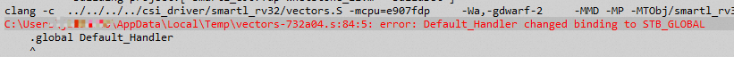
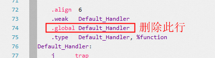
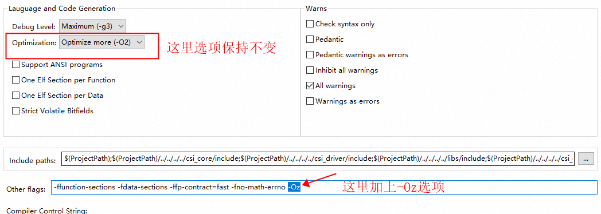
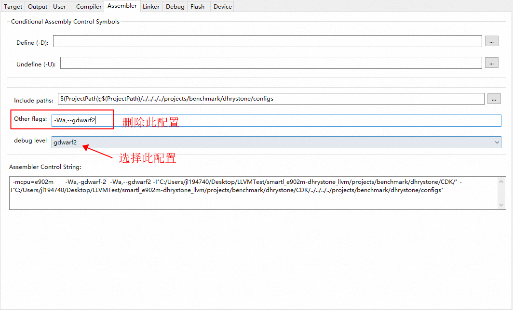
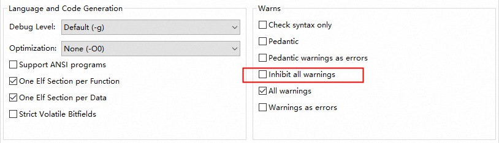
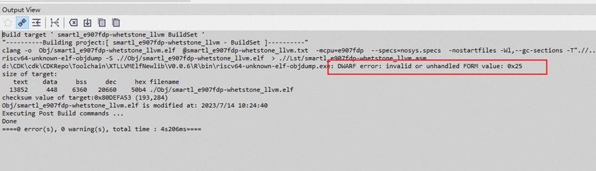

# 玄铁GCC工具链切换玄铁LLVM工具链常见问题汇总 
虽然玄铁LLVM工具链最大程度的兼容玄铁GCC工具链的使用习惯，但优于两者的代码框架差别很大，这就造成了某些具体使用时，
玄铁LLVM工具链和玄铁GCC工具链仍然有一些不太兼容的地方，为了能够让用户更方便地使用代码密度更优、
程序性能更好的玄铁LLVM工具链， 这里需要对一些常见的使用问题给出解决方法；

***
【问题】工程编译汇编文件报错 "xxxxx changed binding to STB_GLOBAL"的错误信息

【解决方法】

1 找到出错的文件，一般是汇编文件

2 在文件中搜索.weak（Ctrl+F打开文件搜索窗口）

3 每个.weak的下一行的.global字样直接删掉

 

***
【问题】使用玄铁LLVM工具链编译的工程的代码size没有明显的降低，甚至还有所增加

【解决方法】

这个问题一般是选项没有配置合理导致的，玄铁LLVM工具链的代码密度优化的最优选项是-Oz而不是-Os，
所以工程中的配置和玄铁GCC工具链配置稍有不同，只要在工程配置的CompilerTab中的Other Flags中增加-Oz选项即可；

此外，如果使用的玄铁CPU包含了浮点向量等硬件支持，还需要在CompilerTab中的Other Flags中增加
-ffp-contract=fast -fno-math-errno选项

通过增加这个选项，可以有效减少编译工程的代码密度

 

***
【问题】编译报错 clang: error: unsupported argument '--gdwarf2' to option '-Wa,'

【解决方法】

工程配置Assembler Tab中，查看Other flags中是否包含了 -Wa,--gdwarf2 选项，如果包含，请直接删除，在对应界面中的
debug level下拉框中选择gdwarf2即可

 

***
【问题】工程配置选择玄铁LLVM工具链以后，偶现代码查看、代码自动诊断等功能无法正常使用

【解决方法】

1 首先右击工程，点击Open Containing Folder...，弹出工程所在的目录；

2 然后关闭CDK，关闭以后，把工程所在目录下的.cache/ 目录删除；

4 重新打开CDK即可；

 

***
【问题】同样的工程，使用玄铁GCC工具链没有警告信息，使用玄铁LLVM工具链，会报很多警告信息出来

【解决方法】

首先，LLVM对于C/C++语言的检测更为严格，如果能够根据警告信息逐个修改这些源代码中存在的潜在问题最好，
如果需要忽略这些信息的话，可以勾选工程配置Compiler Tab中的Inhibit all warnings即可；

 

***
【问题】编译成功，但是界面显示DWARF error: invalid or unhandled FORM value: 0x25字样

【解决方法】

这个问题目前是玄铁LLVM工具链的编译调试信息和玄铁GCC工具链调试信息格式不兼容导致的，不会引起程序错误，
可以暂时忽略该问题，后续版本迭代解决；

 

***
【问题】

【解决方法】

 

# 其它问题、意见和建议
如果您在使用中遇到了其它难以解决的问题或者有更好的改进意见和建议，欢迎提交
[OCC工单](https://xuantie.t-head.cn/people/workorder-submit)， 把问题或建议及时反馈给我们；

 
 

***

平头哥半导体有限公司 版权所有

