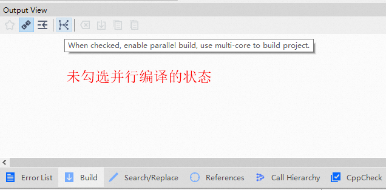
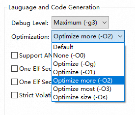
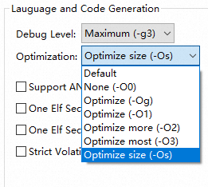
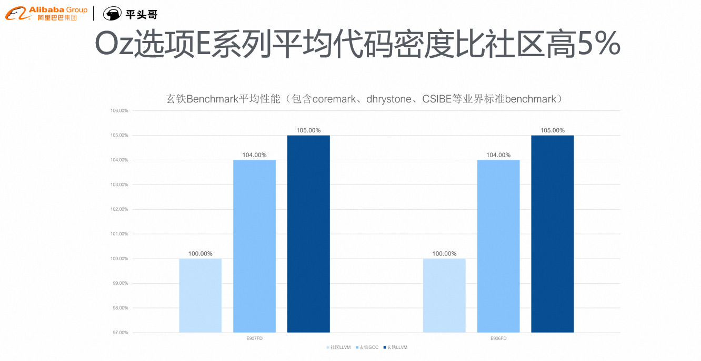
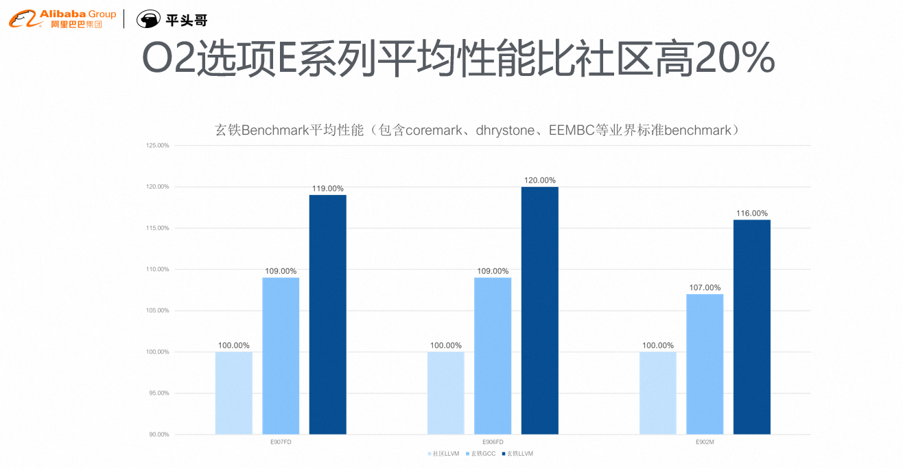
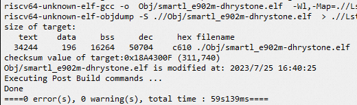
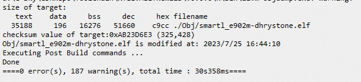

# 平头哥玄铁LLVM工具链发布

平头哥官方推出了玄铁LLVM工具链，
并在[CDK V2.22.0](https://xuantie.t-head.cn/community/download?id=4210079943993921536) 
版本中做了支持，欢迎大家试用玄铁LLVM工具链~~

## 概要
玄铁LLVM工具链是基于开源Clang/LLVM工具链开发的平头哥玄铁处理器的闭源工具链。
在开源Clang/LLVM工具链的基础上，玄铁LLVM工具链增加了对玄铁系列处理器的支持，
并通过对玄铁处理器的定制优化，强化了程序在玄铁处理器上的运行性能和代码密度。
相比于玄铁GCC工具链，玄铁LLVM工具链具有编译速度更快，程序性能更高，各类工具更丰富等优点。

## 玄铁LLVM工具链的优势
玄铁LLVM工具链的代码框架相比于GCC更加优秀，因此也能给开发者带来很多优势，对于CDK的使用者来说，具体可以包含：

    1 工程构建速度更快
    2 工程代码的二进制代码段更小
    3 程序性能更高
    4 对玄铁GCC工具链的兼容性良好
    5 代码编译更加严谨

下面，我们详细的介绍上述每个优势的具体内容：

### 1 工程构建速度更快
为了更加明显的对比出玄铁LLVM和玄铁GCC的编译时间，本文的对比都是CDK中关闭并行编译选项基础上进行的

    关闭CDK中的并行编译选项，既取消Build窗口中parallel build button的勾选；

工程构建时间结果如下：

| 验证工程名                    | 玄铁GCC工具链 | 玄铁LLVM工具链 | 提升百分比 |
|--------------------------|----------|-----------|-------|
| smartl_e902m-dhrystone   | 50s      | 30s       | 40%   |
| smartl_e907fdp-dhrystone | 48s      | 31s       | 35%   |
| 总计                       | 98s      | 61s       | 37%   |

可以看到整体的构建时间，相比于玄铁GCC构建时间，提升至少1/3以上的时间；

***

### 2 工程二进制代码段更小
工程的构建一般分为性能优先还是代码size优先的方式进行构建

    优先考虑性能时，采用-O2的选项即可
在优先考虑性能的情况下，工程构建的程序段大小结果如下：

| 验证工程名                    | 玄铁GCC工具链 | 玄铁LLVM工具链 | 提升百分比 |
|--------------------------|----------|-----------|-------|
| smartl_e902m-dhrystone   | 26140    | 26064     | 0.3%  |
| smartl_e907fdp-dhrystone | 17584    | 16860     | 4.1%  |

可以看到，在性能优先的前提下，玄铁LLVM工具链的工程代码大小虽然没有明显优势，但仍优于玄铁GCC工具链

***

    优先考虑代码size时，采用-Os的选项即可
需要注意，对于玄铁LLVM工具链来说，代码密度最有的优化选项不是-Os，而是-Oz，因此，使用该工具链的时候，
需要在Other Flags中增加 -Oz 选项即可；

    
    玄铁LLVM工具链进行代码密度优化时，使用-Oz达到最优解

在双方工具链都优先考虑代码密度的情况下，工程构建的程序段大小结果如下：

| 验证工程名                    | 玄铁GCC工具链 | 玄铁LLVM工具链 | 提升百分比 |
|--------------------------|----------|-----------|-------|
| smartl_e902m-dhrystone   | 23932    | 22980     | 3.9%  |
| smartl_e907fdp-dhrystone | 15752    | 13600     | 13.6% |
| smartl_e907fdp-whetstone | 12544    | 10576     | 15.6% |

可以看到，在代码密度优先的前提下，玄铁LLVM工具链优于玄铁GCC工具链，并且对于浮点类型的CPU来说，优势明显；

注意本例中对于smartl_e907fdp-dhrystone浮点类型的工程，构建选项中增加了-ffp-contract=fast选项
和-fno-math-errno选项 这个选项是为了与GCC的浮点编译进行对比而增加的

***

综合来说，玄铁LLVM工具链对于E系列的玄铁CPU的代码密度普遍优于社区LLVM以及玄铁GCC，下图是平头哥官方测试数据结果

***

### 3 程序性能更高

玄铁LLVM工具链对玄铁系列处理器进行了定制优化，并增加了一些开源社区没有的优化算法，
因此相比于开源Clang/LLVM工具链和玄铁GCC工具链都有一定的性能提升。
以下是开源Clang/LLVM工具链，玄铁GCC工具链和玄铁LLVM工具链三者在常见benchmark的上的性能对比

这里，这里我们同样使用 smartl_e902m-dhrystone、smartl_e907fdp-dhrystone和smartl_e907fdp-whetstone
作为实验对比，编译参数使用默认的-O2（性能优先）的优化方式，性能运行结果如下：

| 验证工程名                    | 玄铁GCC工具链       | 玄铁LLVM工具链      | 提升百分比 |
|--------------------------|----------------|----------------|-------|
| smartl_e902m-dhrystone   | 1.53 DMIPS/MHz | 1.66 DMIPS/MHz | 8.5%  |
| smartl_e907fdp-dhrystone | 2.15 DMIPS/MHz | 2.34 DMIPS/MHz | 8.8%  |
| smartl_e907fdp-whetstone | 167.4 MIPS     | 224.5 MIPS     | 34.1% |

可以看到，玄铁LLVM工具链对于处理器性能有显著的提升，

***

综合来说，玄铁LLVM工具链对于E系列的玄铁CPU的代码性能普遍优于社区LLVM以及玄铁GCC，下图是平头哥官方测试数据结果

***

### 4 对玄铁GCC工具链的兼容性良好
玄铁LLVM工具链虽然与GCC技术框架完全不同，因此在一些对于C/C++语言的处理的细节中会有不同，
但玄铁LLVM工具链从产品使用角度，尽量保留了GCC应用的习惯和特性，这样，
可以极大的降低开发人员从玄铁GCC工具链迁移的成本，玄铁LLVM工具链与玄铁GCC工具链的使用界面几乎一致；
对于一些与GCC在使用中的常见的不同之处，欢迎参考 [玄铁GCC工具链切换玄铁LLVM工具链常见问题汇总](Q_A/index.md) 中描述的内容

除此以外，玄铁LLVM工具链保留了开源Clang/LLVM工具链套件中的大部分的二进制工具，
除了常见的与GNU对应的objdump、readelf等，还有一些其他的二进制工具，
比如clang-format、clang-refactor、llvm-xray等。这些二进制工具在调试、重构代码等场景下都有较好的应用。

***

### 5 代码编译更加严谨

LLVM工具链编译C语言时，能够以更加严谨的逻辑去检查源代码文件，并给出warning建议，帮助开发者改进代码；

与GCC工具链相比，这种warning更加严谨，例如，以CDK中编译smartl_e902m-drystone工程为例，
默认使用GCC工具链编译，编译完成，结果显示没有任何warning信息；

同样的工程、同样的配置情况下，切换工具链到LLVM，然后重新编译，结果会显示187条警告信息；

更严谨的代码检查，能够让程序的运行更加有保障；

***

## 如何在CDK中使用玄铁LLVM工具链
如何在CDK中使用LLVM工具链呢？ 

如何把当前CDK工程中使用的GCC工具链替换成LLVM工具链呢？

关于这个问题，欢迎访问[CDK中使用玄铁LLVM工具链教程](CDK/index.md)获取详细操作步骤；

## 其它问题
请参考[玄铁GCC工具链切换玄铁LLVM工具链常见问题汇总](Q_A/index.md) 中的信息;

如果有其它问题，可以提交[OCC工单](https://xuantie.t-head.cn/people/workorder-submit),会有专业的人员对接问题；

 
 

***

平头哥半导体有限公司 版权所有

