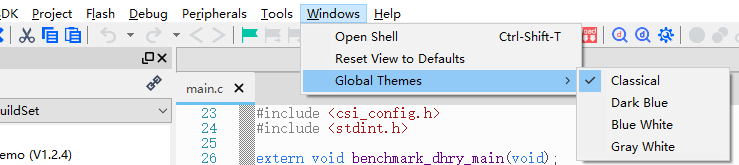
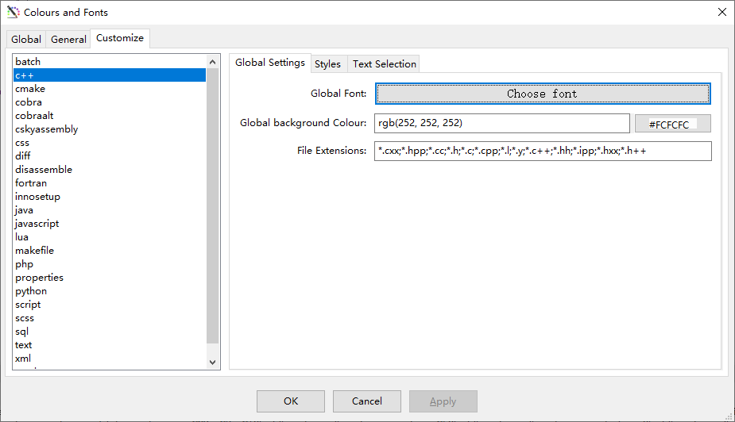
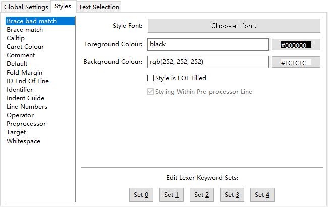
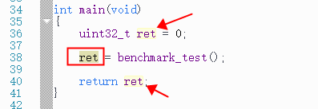
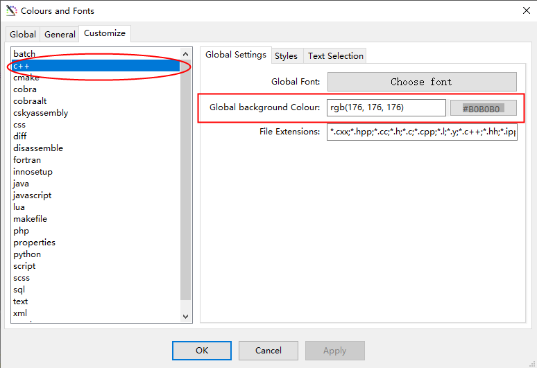
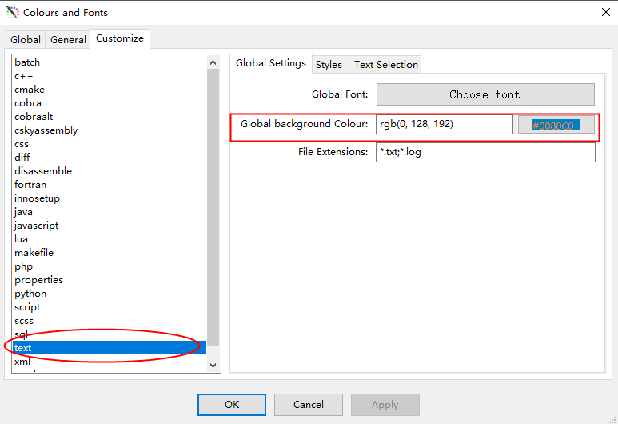
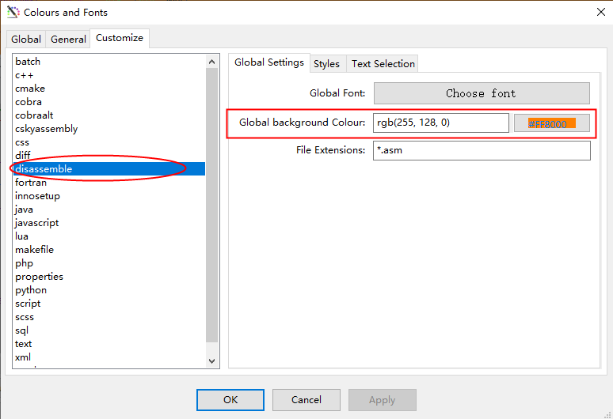
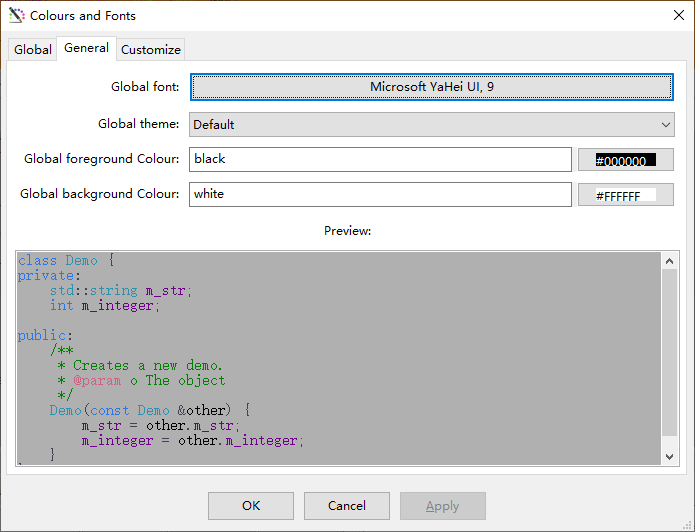

# DIY自己的CDK界面风格

当前CDK除了默认的Windiwos系统风格（classical）以外，还提供给了三种界面风格供使用，他们分别是深蓝风格（dark blue）、灰白风格（gray white）
和蓝白风格（blue white），这三种风格是CDK默认提供的定制化风格，每种风格都有其特定的颜色设置；

用户可以在菜单栏Windows->Global Themes中一键切换不同的风格

除了以上三种CDK定制的风格以外，其实CDK中的Classical风格提供了各类风格的定制界面，并且这些设置实时有效，
用户无需重启CDK即可使用配置方案，并且CDK自动保存配色设置，后续启动时，CDK继续此配置方案；

下面本文分别针对的提供配置说明；

## 文本窗口的配置方案
Classical默认提供的源代码窗口是亮色系为主，用户可以根据自己的喜好，DIY自己的源代码配置，这个配置入口在
菜单栏Edit->Configuration->Colours and Fonts

点击以后，弹出的对话框中选择Customize Tab

这个界面分为两个部分：

    1 左侧文本类型分类列表
    2 右侧配置界面

### 左侧文本类型分类列表

列表中是CDK支持的各种文本类型，CDK支持为每种文本类型设置不同的配色方案，例如C/C++的源代码和汇编语言的源代码可以配置完全不同的规则，
用户可以在对应右侧配置界面中设置不同的背景色、高亮关键字、以及括号、注释、数字、操作符等各类字符串的颜色；

### 右侧配置界面
这里又包含了三个配置界面

    1 Global Settings
    2 Styles
    3 Text Selection
#### Global Settings Tab

这里可以设置字体、背景色、以及对应的文件后缀（文件后缀如无需要，不建议修改）
#### Styles Tab

这个界面设置更多的细节，CDK为每个文本类型提供了一些基本语法单元，每个文件类型不同，上图是makefile类型的文本语法类型，
用户可以对每个语法类型设置不同的前景色、背景色以及字体；

除此以外，每个文本语法类型的关键字除了默认的，还提供了Set 0 ~ Set 4 ，5组不同的用户可自定义的关键字（如无特别需要，不建议更改）；

#### Text Selection Tab

这个界面，可以配置用户在选择了一个文本以后，同文件中同名文本的高亮的字体的颜色和背景色；

如上图，在源代码中如果选择了ret，那么文本中其他“ret”字样会默认高亮；

以上就是文本窗口的配置方案的主要内容，这里，挑选一些常用的配置功能入口，用户可以根据入口，设置自己的颜色方案；

***

配置入口Edit->Configuration->Colours and Fonts，Customize Tab中C++的Global Settings中的Global background Colour；

通过这里的配置，可以影响如下窗口的背景色：

| 影响的窗口                                                                   | 
|-------------------------------------------------------------------------|
| C/C++源代码窗口 （文件后缀 cxx; hpp; cc; h; c; cpp; l; y; c++; hh; ipp; hxx; h++） |
| Output View中的Search/Replace窗口                                           |
| Output View中的Reference窗口                                                |

***
***

配置入口Edit->Configuration->Colours and Fonts，Customize Tab中text的Global Settings中的Global background Colour；

通过这里的配置，可以影响如下窗口的背景色：

| 影响的窗口                                                | 
|------------------------------------------------------|
| 代码窗口中的纯文本文件 （文件后缀 txt; log，除此以外，其他init脚本、ld文件等也受此影响） |
| Output View中的Build窗口                                 |
| Output View中的CppCheck窗口                              |

***
***

配置入口Edit->Configuration->Colours and Fonts，Customize Tab中disassemble的Global Settings中的Global background Colour；

通过这里的配置，可以影响如下窗口的背景色：

| 影响的窗口                  | 
|------------------------|
| 代码窗口中的反汇编文件 （文件后缀 asm） |
| 调试视图中的反汇编窗口            |
| 调试视图中的内存窗口             |
| 窗口窗口                   |

## 其他通用窗口的配置方案

这里用来配置一般窗口的字体、字体颜色、背景色等信息；

通常情况下，如果特别需要，不建议设置Global font，一般只需要设置Global foreground Colour和
Global background Colour即可；

这里的配置影响除上述窗口以外的窗口，至少包含如下窗口的背景色以及字体颜色：

| 影响的窗口                                 | 
|---------------------------------------|
| Project窗口                             |
| Outline窗口                             |
| Output View中的Build窗口 Call Hierarchy窗口 |
| Output View中的Build窗口 Error窗口          |
| 调试视图中的寄存器窗口                           |
| 调试视图中的断点窗口                            |
| 调试视图中的线程窗口                            |
| 调试视图中的Output窗口                        |
| 调试视图中的Command窗口                       |
| 调试视图中的PC Trace窗口                      |
| 调试视图中的Statistics窗口                    |
| 调试视图中的Locals窗口                        |
| 调试视图中的Watches窗口                       |
| 调试视图中的Call Stack窗口                    |

## 代码窗口的其他特性配置
除了上述的配置界面，CDK还提供了其他额外的特性的配置入口，这里列出一些重要的常用功能的配置；