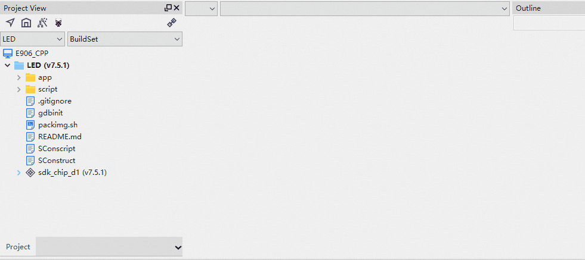
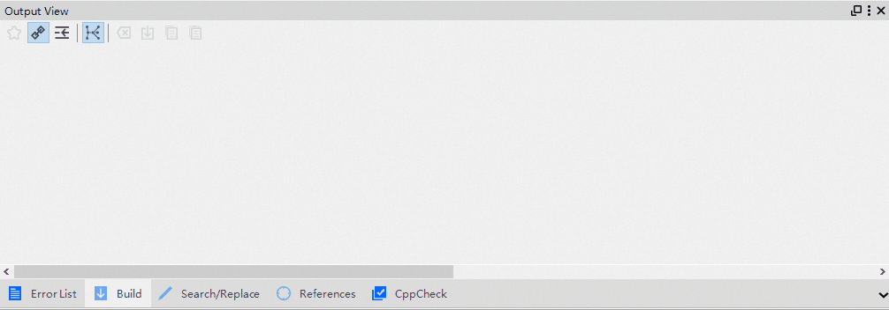
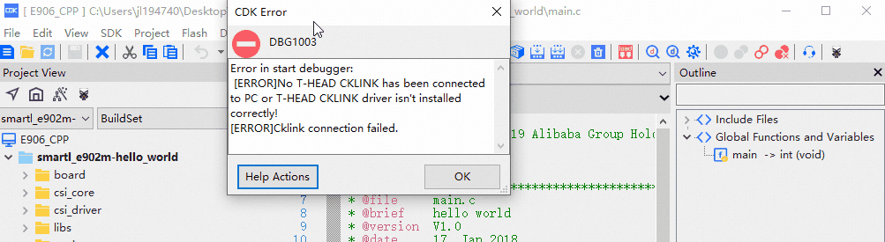
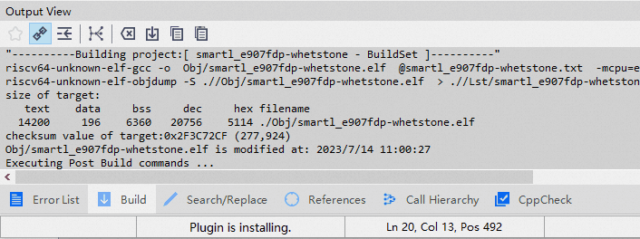
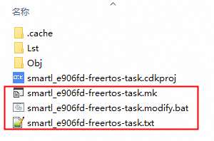
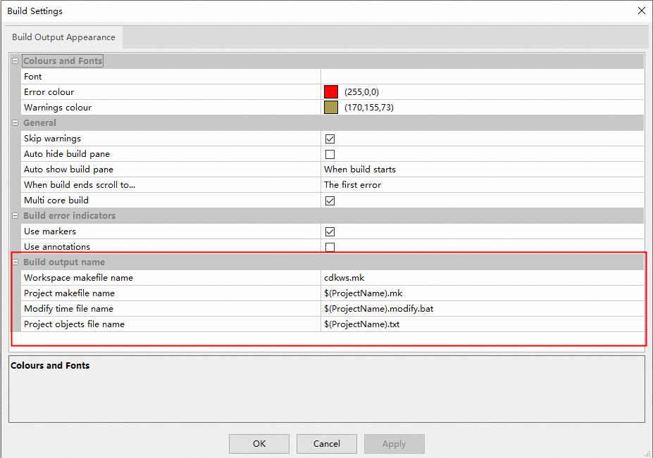

# CDK V2.22.0版本特性介绍

## CDK V2.22.0版本发布

经过剑池CDK开发程序猿小哥哥们的努力，
[CDK V2.22.0]() 
终于得以和开发者见面啦，本次CDK的更新，除了V2.20版本的使用反馈的改进以外，还专门做了两个较大的功能更新：

    1 发布基于玄铁CPU的LLVM工具链
    2 实现CDK错误信息的辅助解决功能

### 发布基于玄铁CPU的LLVM工具链

平头哥玄铁LLVM工具链发布啦，相比于GCC，它能给开发者带来很多优势，对于CDK的使用者来说，具体可以包含：

    1 工程构建速度更快
    2 工程代码的二进制代码段更小
    3 程序性能更高
    4 对玄铁GCC工具链的兼容性良好
    5 代码编译更加严谨

具体细节，欢迎参考[LLVM工具链发布页](../LLVM/index.md)中的内容；

### CDK错误信息的辅助解决功能

新版本的CDK中，整合了内部错误以及外部模块的错误信息，并把它们进行了归类整理，并且加强了错误识别的能力，
在工程视图、工程编译、调试、烧写的各个开发过程中，遇到各错误情况时，都会弹出相关帮助提示按钮，
通过提示按钮，可以自动识别错误信息，如果CDK可以自动解决，则尝试自动解决；如果CDK无法自动解决，
则会弹出帮助解决的页面，协助用户解决此类问题；

对于用户无法解决的问题，CDK都提供了提交错误的工单入口，由平头哥内部人员解决CDK问题；

#### 工程视图错误

鼠标悬浮，错误提示按钮显示，可以根据具体的错误，一键解决，也可以View Detail去查看具体的错误信息、原因及解决方法；

#### 工程编译错误

鼠标悬浮在编译窗口的错误或者警告处，会显示错误提示按钮，可以根据错误情况，查看错误解释和解决方法，也可以一键辅助错误解决；

#### 弹框错误

在遇到CDK的弹框错误时，左下角的Help Actions按钮可以提供针对当前错误的详细信息以及解决的方法；

### 其它问题的修改说明

除了上述两个主要功能以外，CDK还针对之前版本的问题反馈做了较大的改进，例如：

#### DIY自己的CDK界面风格

允许开发者配置CDK中的各类窗口、代码块的颜色，定义自己的CDK界面；

具体细节可以参考[DIY自己的CDK界面风格](../NewTheme/index.md)中的详细设置方法；

#### 更新了插件缺失自动下载能力

旧版本CDK中，如果遇到缺失的插件（工具链、调试器等），需要开发者自己找到插件管理窗口，并且选择对应的版本号下载，
新版本中，如果遇到缺失的任何插件，CDK都会自动尝试安装，并且安装信息会在CDK底部状态栏实时更新；

#### 工程编译临时文件名可自定义

CDK工程在构建时，可能会产生一些临时文件，用于辅助文件的编译；

对于一些有版本管理需求的开发人员来说，这些文件名称不便于仓库的版本管理，新版本中，
CDK提供给开发者对于这些文件自定义的入口，在菜单栏Edit->Configuration->Build Settings入口；

上述临时文件的名称、后缀都可以自己定义；

### 其它更新和修复说明

修复问题说明：

    1 修复了断网情况下，CDK启动过程慢的问题；
    2 修复了某些情况下，玄铁900工程编译链接失败的问题；
    3 修复了玄铁900工程的C库配置错误的问题；
    4 修复了编辑器中光标颜色设置失败的问题；
    5 修复了编辑代码中列编辑模式下的代码联想问题；
    6 修复了某些配置下，Download按钮Flash下载无效的问题；
    7 修复了某些情况下插件更新卡顿的问题；
    8 修复了多工程Workspace下CDK启动变慢的问题；

***

功能新增、优化与更新说明：

    1 工程配置Pre/PostBuild脚本新增了bat格式的支持；
    2 更新了Help文档的内容，删除了无效的章节；
    3 新增了链接描述文件支持预处理的功能；
    4 新增了Flash驱动的类型接口，支持eMMC存储器的烧写；
    5 优化了工程代码编辑和查看功能的稳定性；
    6 更新了工程配置Flash页面的算法配置页面，支持了手动配置算法文件；
    7 更新了工程配置Debug页面，新增了SVC文件配置入口；
    8 优化了Flash下载ihex格式文件时的效率；
    9 更新了SVC文件的第三方配置格式；

### 欢迎试用CDK新版本
欢迎感兴趣的厂商或个人[点击这里]()
获取CDK V2.22.0版本下载页；

 
 

***

平头哥半导体有限公司 版权所有
