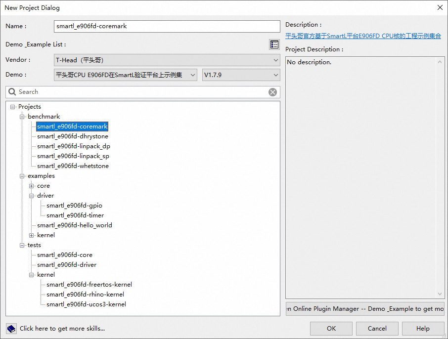
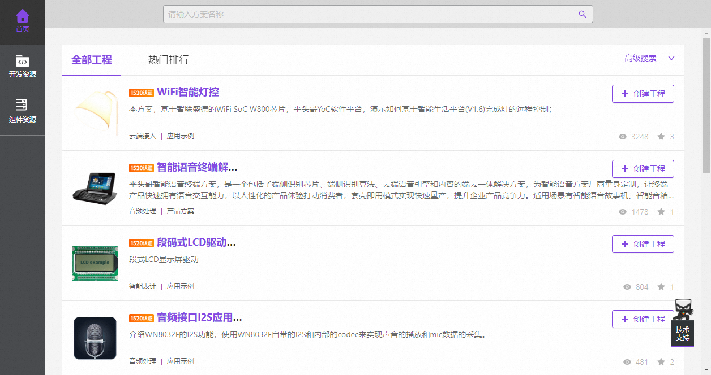
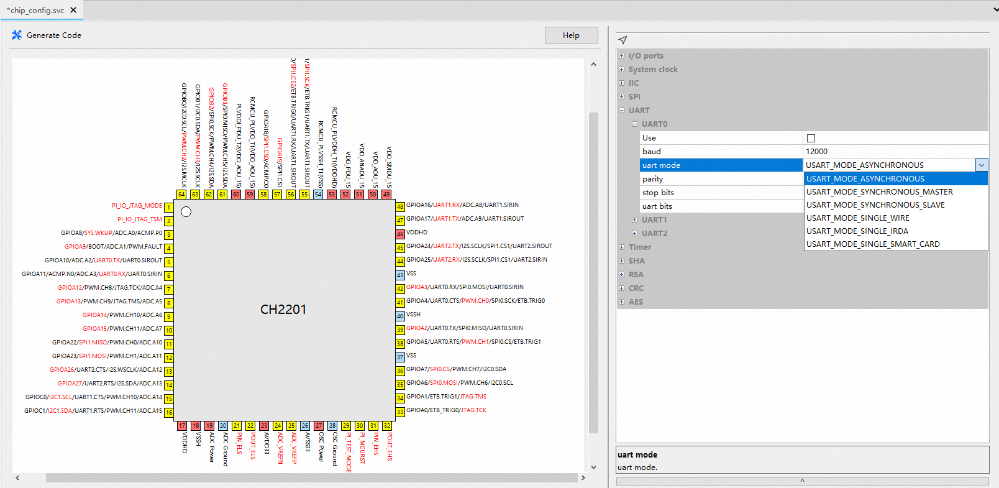
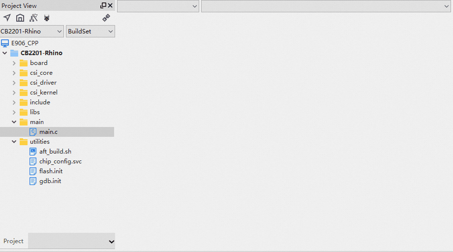
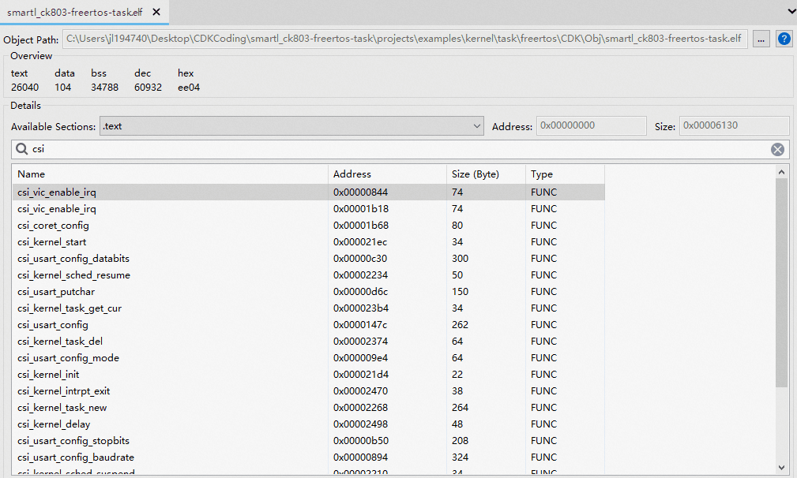
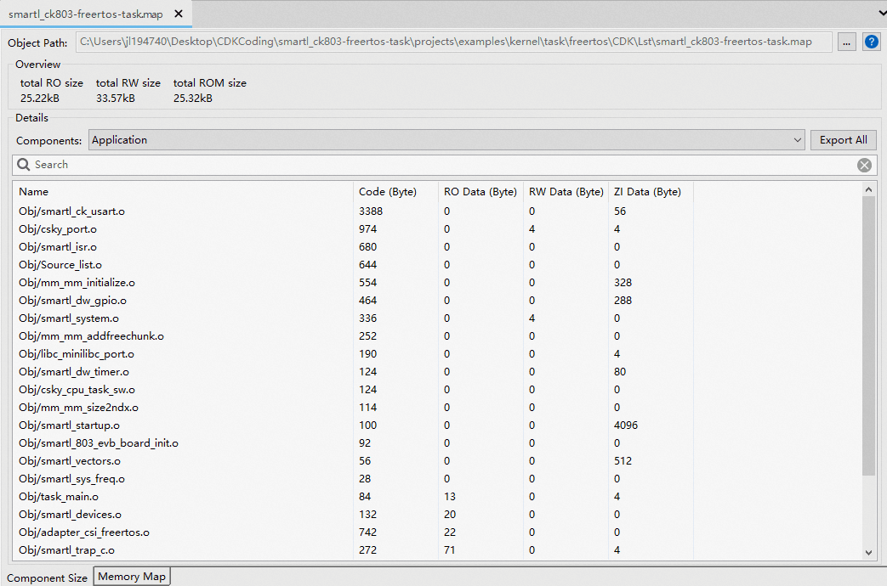
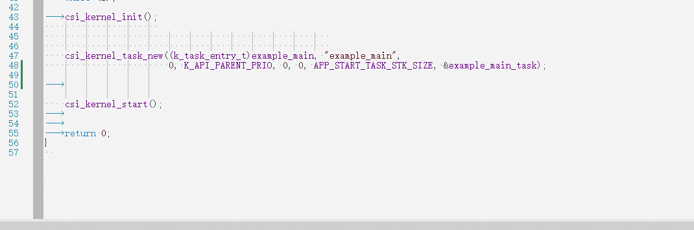
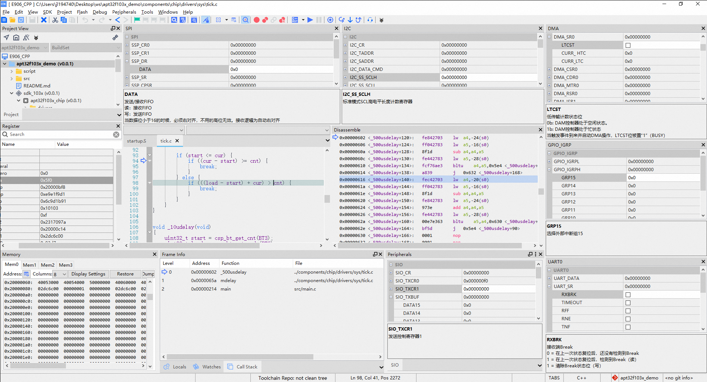
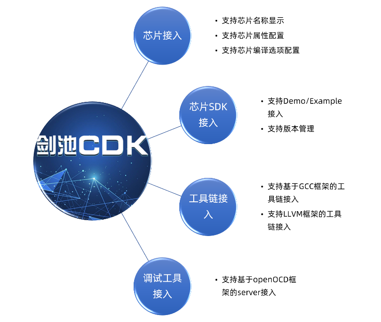
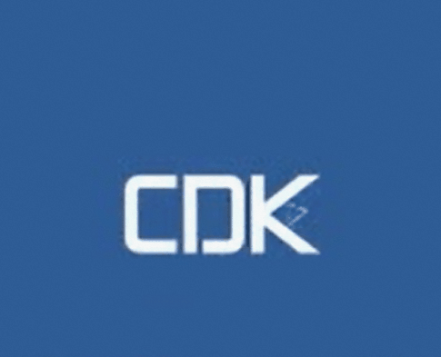

# CDK新特性仓库简介

## 概要

剑池CDK以极简开发为理念，是专业为IoT/AIoT应用开发打造的集成开发环境；在不改变传统MCU应用开发习惯的基础上，
全面接入云端开发资源，并结合图形化的OSTracer、Profiling等调试分析工具，
帮助开发者在工程获取、工程配置、代码开发、Flash下载、调试等开发过程中提供图形界面的支持，意在加速用户产品开发；

## 产品主要特性

### 开发资源的灵活获取

工程创建窗口提供了当前CDK支持的全部厂商的各类Demo，总数超过500个Demo工程，并且这些工程还在持续更新中；
开发者可以根据具体的应用平台以及 具体的应用类型，选择最合适的Demo工程，然后一键完成工程的获取和创建；

***

除此以外，在CDK Welcome页面中，开发者可以选择基于玄铁处理器的各类AIoT应用Demo，进行方案级的开发；

这里的每个工程都可以一键创建，CDK会自动将相关资源下载到本地，并完成工程创建；

### 工程的可视化配置

CDK在工程配置方面具有很好的可视化图形界面配置特性：

#### 芯片管脚初始化可视化配置

提供面向芯片原厂的二次开发界面，能够让用户界面完成具体芯片的管脚级的初始化配置，并一键生成初始化的源代码，
极大的降低了用户编写芯片管脚初始化代码的难度；

#### 文本文件可视化配置

CDK提供了文本文件可视化配置能力，对于任意文本格式的文件（C源文件、头文件、汇编文件、链接描述脚本文件等），
都可以实现可视化的图形配置能力；

通过提供这种可视化服务，可以降低某些晦涩逻辑的配置难度；

#### 工程Elf文件可视化查看

开发者可以查看Elf文件中每个Section中包含的符号信息；不仅如此，双击某个符号，
还会自动跳转到源代码对应的位置，这项功能配合表格头每一列的大小排序，可以迅速的找到源代码中size比较大的函数;

#### 工程map文件可视化查看

通过Map文件的可视化查看，开发者可以对程序的二进制构成做精确的拆分：

    1 最终程序的组成分类，以及每个部分包含的目标文件的代码、数据的大小；
    2 展开每个二进制目标文件的视图，可以定位到源代码的位置；

### 基于LSP的代码编写辅助

采用行业流程的Language Server Protocol的方式进行工程代码的解析，让代码编写更加简便；

### 工程的可视化调试

调试界面可视化调试，包含CPU寄存器、内存、调用栈、变量、外设寄存器、反汇编等常用调试窗口；

### 极简的第三方接入界面

面向第三方RV原厂，提供外部工具接入界面，零代码接入第三方RV芯片及其SDK；

## 关于本网页

本网页是用来对CDK新版本进行特性简介使用；

目前包含的特性如下：

[V2.18.2版本特性](V2.18.2/index.md)

[V2.20.0版本特性](V2.20.0/index.md)

[V2.22.0版本特性](V2.22.0/index.md)

[玄铁LLVM工具链特性](LLVM/index.md)

[CDK界面风格自定义教程](NewTheme/index.md)

[CDK中使用玄铁LLVM工具链教程](LLVM/CDK/index.md)

 
 

***

平头哥半导体有限公司 版权所有
